# 视觉风格参考：14—30

17 种摄影、拼贴、插画与编辑排版风格。选择编号后替换提示词中的变量，即可用于新的内容。参考图与提示词均逐张对应；这些模板尚未逐项试生成。

## 14｜粉色实物杂货目录

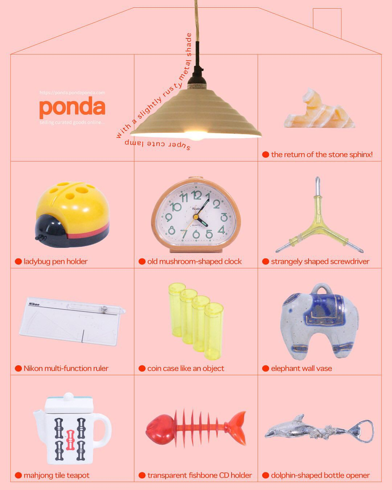

[参考来源](https://uk.pinterest.com/pin/817121926206438914/) · [提示词](prompts/style-14.txt)

生成一张 {画幅} 的实物杂货目录海报，主题为「{主题}」。整页铺浅珊瑚粉，以极细橙色线条建立三列多行货架网格，顶部用屋顶和烟囱轮廓形成小店外观。将 {物件清单} 做成独立摄影抠图，保留陶瓷釉面、透明塑料、金属反光与旧物磨损，各自悬放在格内，尺度略带玩味。一个重点物件可跨越顶部网格，如从页外垂下的吊灯。标签采用橙红色圆点与紧凑无衬线小字，局部短句沿物件弧线环绕。主标题「{主标题}」只占一个格位，留出呼吸空间。仅使用 {文案}；保持照片材质，避免统一改成扁平图标，不复制原图品牌和商品印字。

## 15｜金属磁贴记忆拼贴

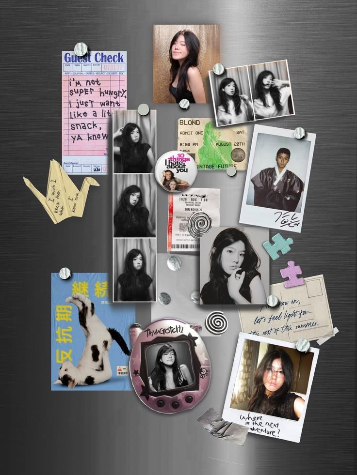

[参考来源](https://uk.pinterest.com/pin/889460995184707406/) · [提示词](prompts/style-15.txt)

生成一张 {画幅} 的私人记忆拼贴，主题为「{主题}」。背景是一整面深灰拉丝不锈钢板，竖向柔和反光与横向细密金属纹理同时可见。把 {照片与纪念物} 错落排列在中部：黑白照相亭连拍条、彩色拍立得、旧票根、手写便笺、折纸、小徽章或电子玩具。使用不同大小的银色圆磁钉固定，少量银色胶带辅助，物件之间有真实遮挡、翘起纸角和浅接触阴影。整体偏灰黑，纸张上的粉、青、淡黄作小面积点缀；手写短句仅用 {文案}。人物来自提供的照片或原创设定，保留其身份，不沿用参考中人物和签名。避免用普通黑纸背景替代金属材质。

## 16｜博物馆撕纸胶带清单

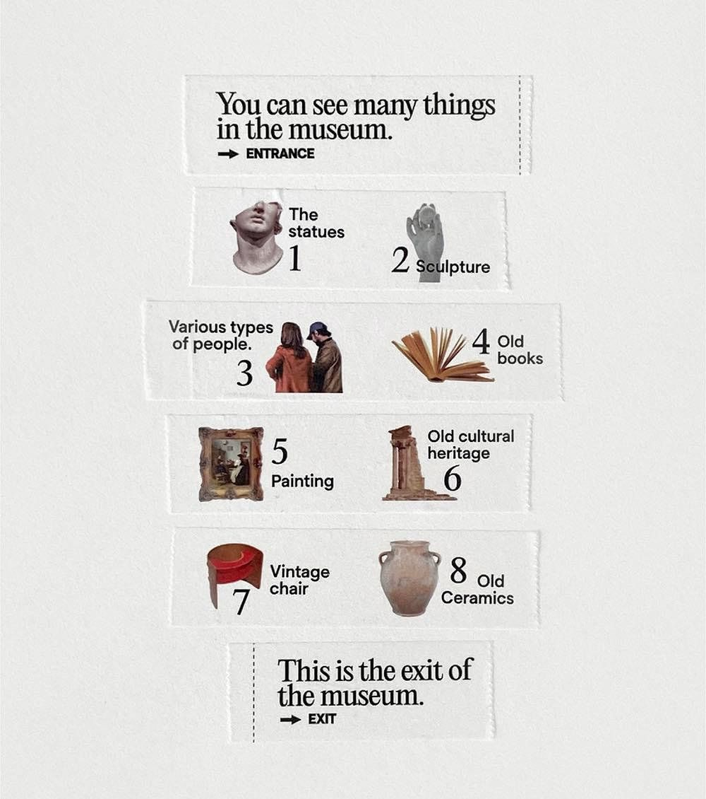

[参考来源](https://uk.pinterest.com/pin/433964114111810174/) · [提示词](prompts/style-16.txt)

生成一张 {画幅} 的博物馆式收藏清单，主题「{主题}」。使用略带纤维纹理的浅灰白纸底，中部叠贴一列宽窄略不同的半透明白纸或纸胶带横条，保留细微撕边、毛边和边缘投影。上下两条分别写「{主标题}」和「{结尾文案}」，配简短方向箭头。中间横条每条放两个来自 {展品清单} 的写实抠图、清楚的大号黑色衬线编号与紧凑无衬线短标签。展品保持暗红、棕、灰等自然旧物颜色；纸条位置规整但不机械对齐，周围大面积留白。仅使用 {文案}。避免画成图标表格、黑色框卡或彩色粗线手账，不加入原图机构、签名或错误拼写。

## 17｜复古桌面物件拼贴

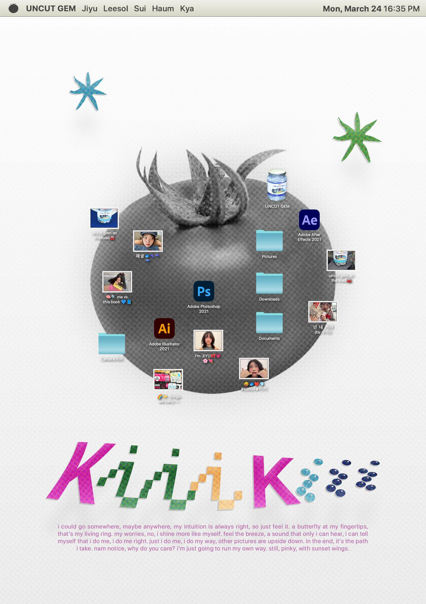

[参考来源](https://uk.pinterest.com/pin/708965166383728381/) · [提示词](prompts/style-17.txt)

生成一张 {画幅} 的复古电脑桌面拼贴海报，主题「{主题}」。浅灰白背景顶部放细窄米灰菜单栏，仅写提供的 {菜单短词}。中央偏下放一枚占幅较大的 {核心物件} 黑白摄影抠图，表面覆盖可见印刷网点，轮廓保持可辨。将青蓝渐变文件夹、带白边的小照片缩略图和原创应用图标，像桌面文件一样疏密错落地摆在物件上与周边，每个只配一行 {标签清单}。上方保留大面积空白，少量彩色星形作平衡。底部用斜体、像素阶梯和圆点混排的彩色字形写「{主标题}」，下方仅用 {短文案}。保持早期个人电脑与独立音乐企划的混合质感，不沿用参考艺人照片、软件商标、歌词或日期。

## 18｜像素柔焦选框研究板

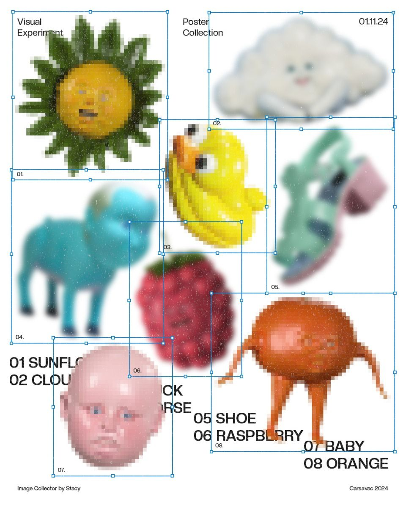

[参考来源](https://uk.pinterest.com/pin/752241944042252263/) · [提示词](prompts/style-18.txt)

生成一张 {画幅} 的数字物件研究板，主题「{主题}」。纯白底上放置 {物件清单} 的摄影或拟物图像样本，各自大小不同，疏松重叠。部分样本处理成明显方块像素，其他样本使用柔焦或失焦模糊，保持原有鲜亮颜色与大体轮廓。为每个样本保留细蓝色矩形编辑选框、四角与边中点的小方形控制柄，框线可交叉穿过相邻图像。顶部少量黑色无衬线标题「{主标题}」，底部或样本旁放错位但可读的编号清单 {标签清单}。叠加轻微扫描噪点。应像编辑过程中停留的一帧，避免全部统一低饱和、统一清晰或规整卡片化，不含软件商标和来源署名。

## 19｜黑色软体角色绘本提案

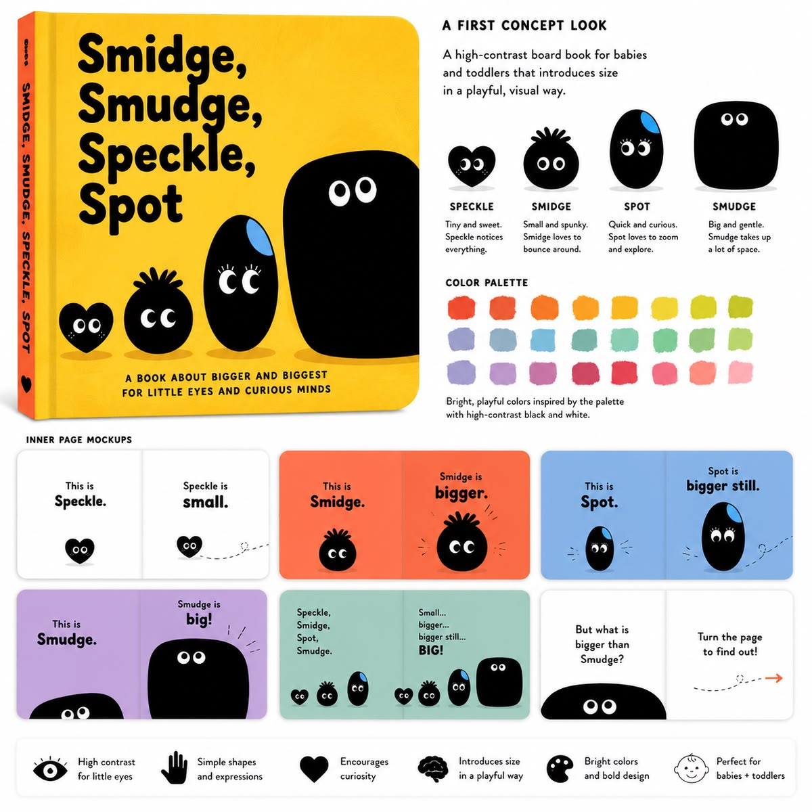

[参考来源](https://uk.pinterest.com/pin/368169338311731896/) · [提示词](prompts/style-19.txt)

生成一张 {画幅} 的原创角色绘本提案板。左上是主标题「{主标题}」的亮黄色厚纸板书封样机，圆角书页、可见书脊和轻微投影；角色由圆润黑色实心形状与白色眼睛构成，通过大小和轮廓差异对应 {角色设定}。右上排列角色对比、小幅说明和手绘色板。下半部展示 {跨页内容} 的多张展开跨页，每个跨页用一种明亮或柔和底色，人物大小关系服务于 {教学主题}。文字采用圆润粗体与少量清晰短句 {文案}。书封可以有实体厚度，页内插画保持平面；避免写实角色、复杂表情和原图角色轮廓、书名或作者名。

## 20｜随手画品牌物件板

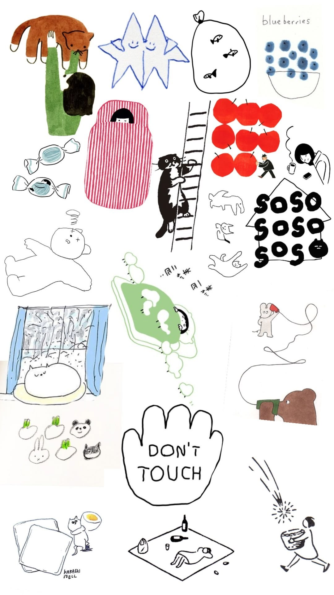

[参考来源](https://uk.pinterest.com/pin/1144969905284367178/) · [提示词](prompts/style-20.txt)

生成一张 {画幅} 的自由手绘品牌灵感板。白色背景上散落与「{主题}」相关的物件、人物、食物、植物和小场景，使用不稳定的黑色手绘线条，局部填入橙红、草绿、浅蓝或粉色，像设计师在纸上快速记录的视觉词汇。画面既有小插图，也有短句、箭头、圈选和轻微重叠，保持一种不完美但亲切的节奏。所有元素都应原创，文字只使用「{文案}」，不要真实品牌、艺术家署名、二维码或精细写实阴影。

## 21｜建筑色块叠印书封

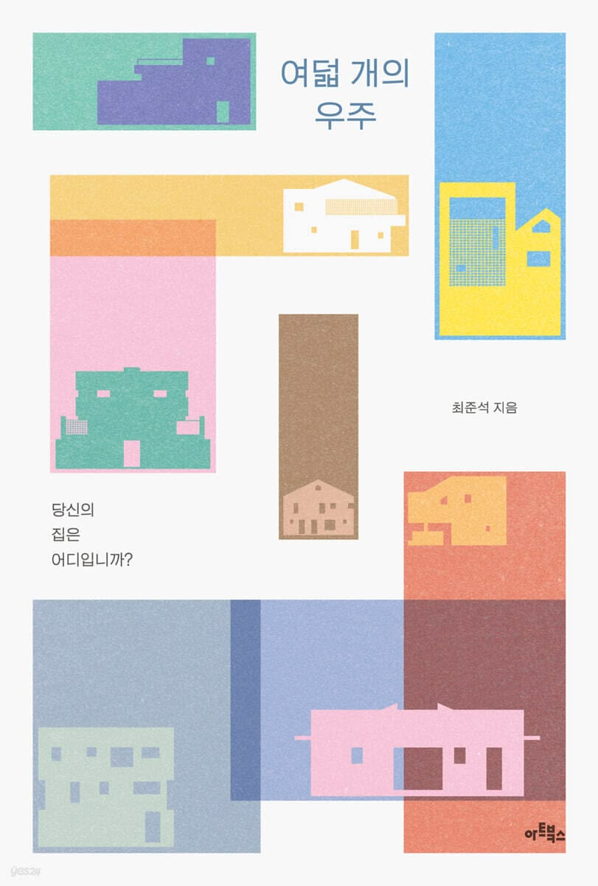

[参考来源](https://uk.pinterest.com/pin/782570872797302131/) · [提示词](prompts/style-21.txt)

生成一张 {画幅} 的建筑主题书封，主题「{主题}」。白底上分布长短不一的横竖矩形，采用粉蓝、薄荷绿、粉色、淡黄、珊瑚橙、灰紫和少量棕色。每块内嵌一枚用矩形门窗和折线屋顶构成的 {建筑或空间清单} 剪影；矩形局部交叠，呈现半透明印刷叠色，内部颗粒均匀细腻。中上部空白放轻盈、克制的标题「{主标题}」，侧边少量 {副标题与署名}。图形可不对称，文字清楚对齐，整体安静且具有建筑尺度。避免画成等距三维城市、满版几何纹样或附加未经提供的出版社标志。

## 22｜蓝色水彩票券套装

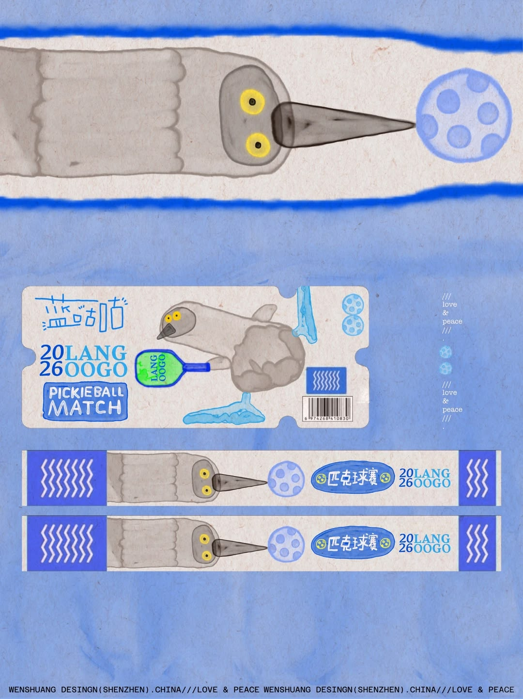

[参考来源](https://uk.pinterest.com/pin/656470083228832421/) · [提示词](prompts/style-22.txt)

生成一张 {画幅} 的活动票券与腕带设计展示板，主题「{主题}」。背景为带纤维颗粒和轻微晕染的浅钴蓝纸。顶部用放大的 {原创角色} 局部作为横幅，中部放一张暖灰白异形票券，边缘有半圆缺口；下部平行排列两条细长腕带。角色采用半透明灰色水彩、细铅笔轮廓与一处明黄或亮绿点睛，钴蓝标记、波浪短线、运动器具对应 {活动内容}。标题「{主标题}」结合手写字与紧凑粗体，三种物料复用同一角色与配色。仅用 {票券文案}；不杜撰可扫描条码、日期、合作方或原图IP，避免改成光滑塑料包装效果。

## 23｜春日童趣九宫格

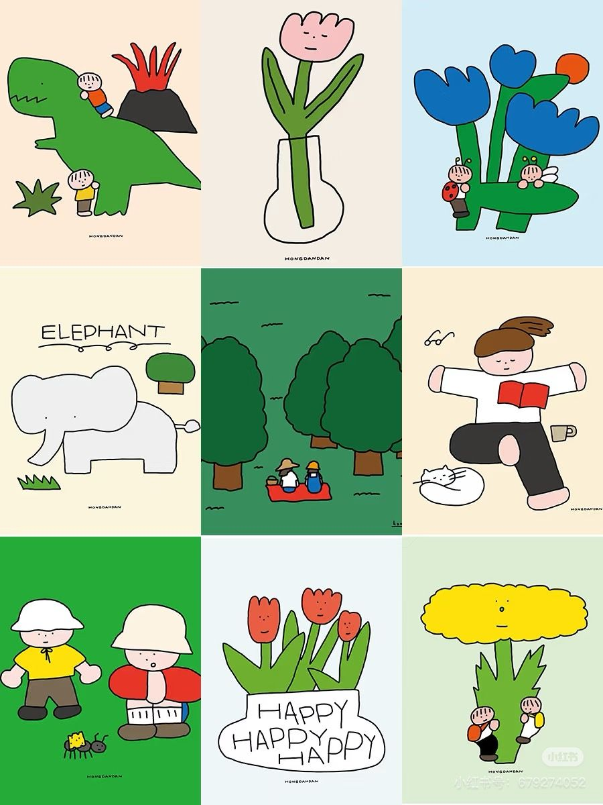

[参考来源](https://uk.pinterest.com/pin/683350943499549487/) · [提示词](prompts/style-23.txt)

生成一张 {画幅} 的春日童趣九宫格插画。将画面分成 3×3 个大小接近的方格，每格使用一块不同的浅色背景，如奶油黄、淡粉、浅蓝、薄荷绿和暖灰；在格内放置一个简单的人物、植物、动物或小动作，线条圆润、填色平面、表情克制可爱。中间或底部加入一个与「{主题}」有关的短句，整体像儿童绘本、春季贴纸页和生活漫画的结合。只使用提供的九个场景和文字，不复制参考图角色，不添加水印和密集说明。

## 24｜黄黑伙伴关系信息图

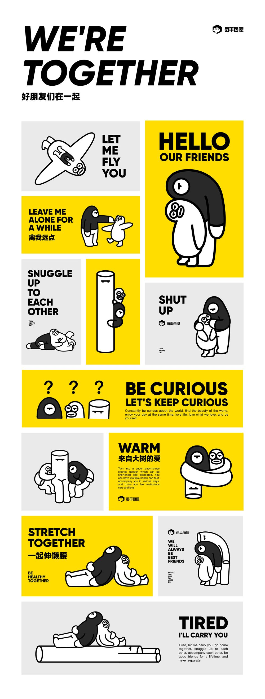

[参考来源](https://uk.pinterest.com/pin/520236194465732493/) · [提示词](prompts/style-24.txt)

生成一张 {画幅} 的伙伴关系或社群信息图。使用白色背景和亮黄色、黑色两种主色，把页面组织成几组竖向模块：大号黑色标题「{主标题}」、黄色标签、黑白原创角色、箭头、问句和简短关系动作。角色可做拥抱、帮助、倾听、好奇、疲惫等不同姿态，线条简洁粗实，模块之间留白明显，整体像一张温暖而有设计感的品牌价值海报。所有文字只用我提供的「{文案}」，不要复制原图口号、角色和品牌标志。

## 25｜粉彩颗粒动作分镜

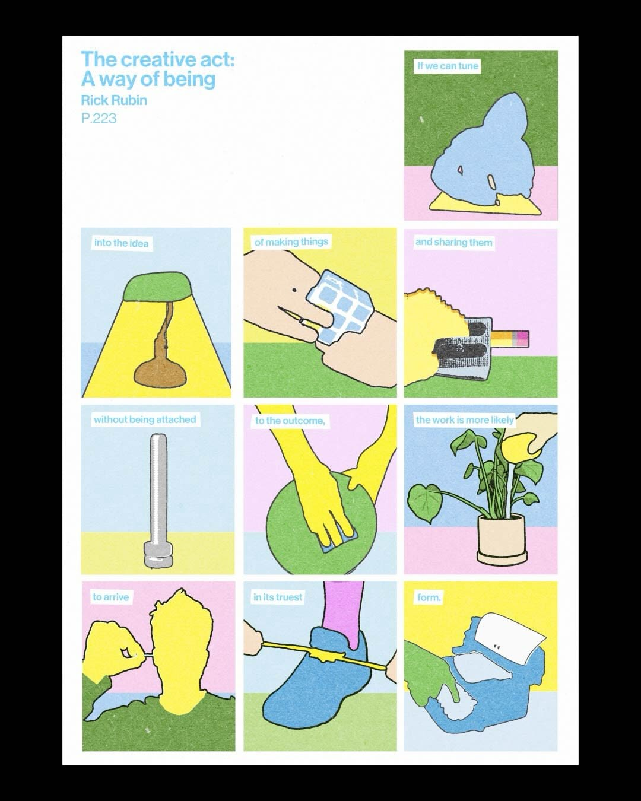

[参考来源](https://uk.pinterest.com/pin/792422496976379417/) · [提示词](prompts/style-25.txt)

生成一张 {画幅} 的创作理念分镜海报，主题「{主题}」。白色版心置于黑色外框内，上方左侧留出约两格宽的空白写浅蓝标题「{主标题}」，右侧安排一个开场小格，下面继续三列彩色方格。每格用 {动作清单} 中的手部动作、工具、植物或局部物件表达一个想法；细黑线轮廓，草绿、浅蓝、柠檬黄与浅粉平涂，覆盖均匀粉笔和印刷颗粒。短句 {分格文案} 放在格内上方的小白色纸条中，自左至右读成连贯叙述。保留图像隐喻与轻微比例夸张。无提供作者时不增加署名，不沿用参考原文，也不强行把内容改写成步骤编号。

## 26｜黑底极简新闻图

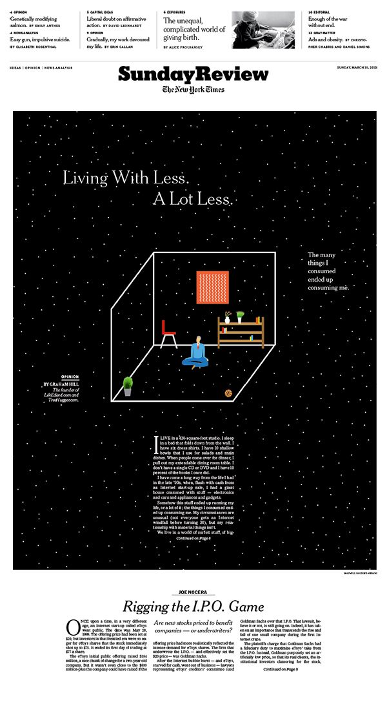

[参考来源](https://uk.pinterest.com/pin/422916221240386237/) · [提示词](prompts/style-26.txt)

生成一张 {画幅} 的极简新闻或评论版面。使用纯黑背景和稀疏的白色点阵，中央放置一个由细线构成的房间、盒子、地图或抽象装置，局部用橙红色或暖黄色标记一个关键点。顶部和侧边安排极少量白色标题、日期、作者栏和短段落，排版像一页高级杂志的观点图。画面必须保留大面积黑色呼吸感，文字只使用我提供的「{主标题}」「{文案}」，不要虚构新闻来源、人物或数据。

## 27｜手写涂鸦品牌延展

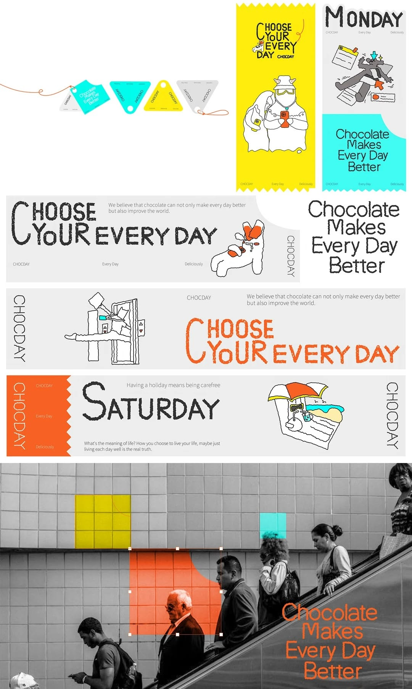

[参考来源](https://uk.pinterest.com/pin/587649451427344343/) · [提示词](prompts/style-27.txt)

生成一张 {画幅} 的品牌视觉延展展示板，主题「{主题}」。白底上组合吊牌、小幅竖版海报与多条横向票券，图形有锯齿边和圆弧切角。视觉系统统一采用粗糙黑色手写大标题「{主标题}」、细线幽默原创人物，以及鲜黄、青绿、橙色、浅灰色块。每个载体使用 {文案} 的不同短句和 {场景清单}，保持字形气质、色彩和人物轮廓一致。底部可加入黑白生活街拍，局部叠加半透明彩色方块及细编辑选框，与上方插画呼应。整体呈现可落地的品牌物料家族，避免流程箭头、密集方案注释、整页软件截图或参考品牌口号。

## 28｜黑白猫咪贴纸格

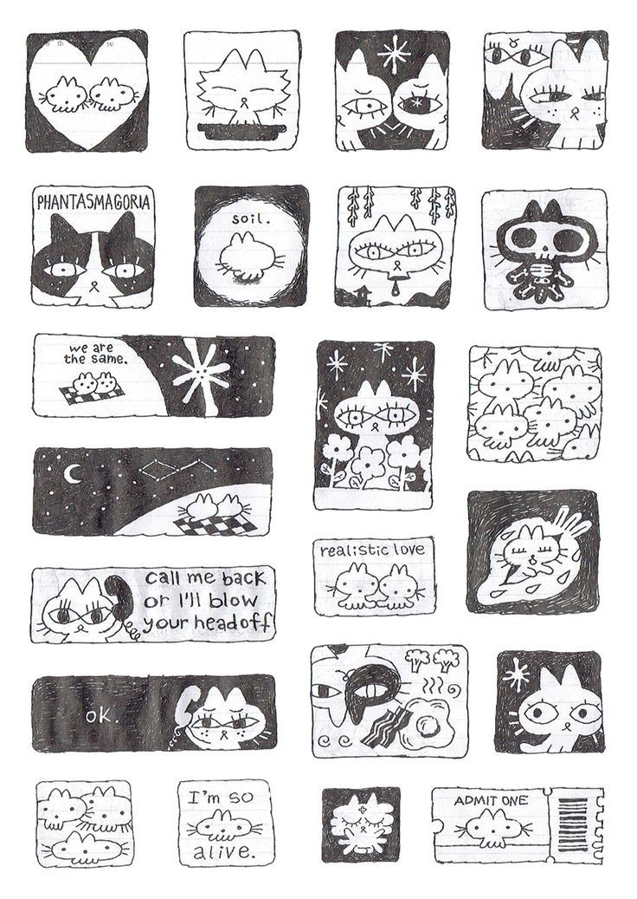

[参考来源](https://uk.pinterest.com/pin/979110775255378139/) · [提示词](prompts/style-28.txt)

生成一张 {画幅} 的黑白手印贴纸或小漫画合集。将页面分成 12—20 个不规则小格，每格放一只原创猫咪或抽象小角色，使用粗黑线、白色留白、少量反白块和不同的纹理图案，如星星、波浪、棋盘、花朵和短横线。每格的动作和表情不同，像丝网印刷贴纸页或独立漫画周边；可以加入极短的手写文字「{文案}」，但不出现连续长段落。保持印刷颗粒和手工边缘，不复制参考图具体猫咪、签名或品牌。

## 29｜红框漫画方法卡

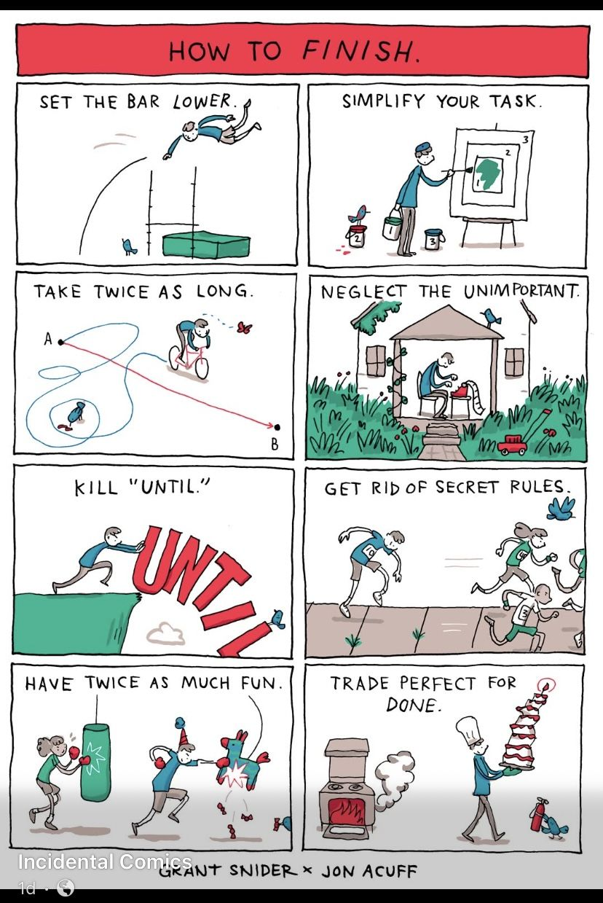

[参考来源](https://uk.pinterest.com/pin/989032768182411408/) · [提示词](prompts/style-29.txt)

生成一张 {画幅} 的方法论漫画海报。使用 2×4 或 3×3 个白底漫画格，每格由细黑线分隔，顶部或格内有醒目的红色标题条和简短黑色手写说明。通过原创人物的夸张动作展示「{主题}」的步骤、误区和改进方式；人物线条简洁，动作清楚，少量使用浅蓝、浅绿和黄色作为道具色。整体像一张可以快速读懂的工作方法卡，节奏明快、带一点自嘲幽默。只使用提供的八个短句，不添加作者名、品牌或虚构对白。

## 30｜人物连线照片墙

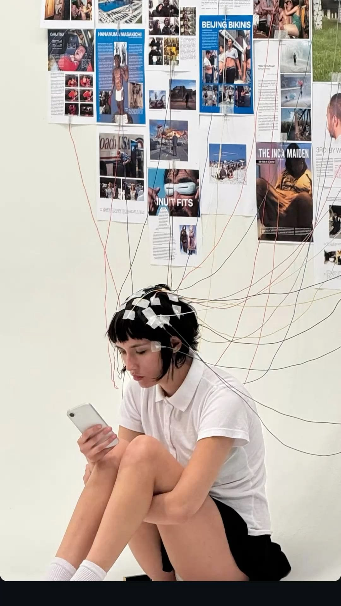

[参考来源](https://uk.pinterest.com/pin/937382109960563202/) · [提示词](prompts/style-30.txt)

生成一张 {画幅} 的概念装置摄影，主题「{主题}」。场景为自然柔光照亮的米白墙面，墙上密集贴着 {资料主题} 相关的照片、印刷页和剪报，保留纸张卷角、胶带与真实透视。画面下半部的一位 {人物设定} 正在 {人物动作}，神态自然，衣服与空间色彩克制。多根红、灰、黑细线从墙上纸页自然下垂并连接到人物附近或轻贴于头发的纸胶带上，表现人与信息的关系；连接必须有物理走向与重力感。采用纪实摄影质感，保留真实皮肤、纺织物与纸张细节。仅在有需要时写短标题 {主标题}，无文案时留空；避免悬浮信息卡、发光科幻线条、未经提供的真实报刊长文或署名。
